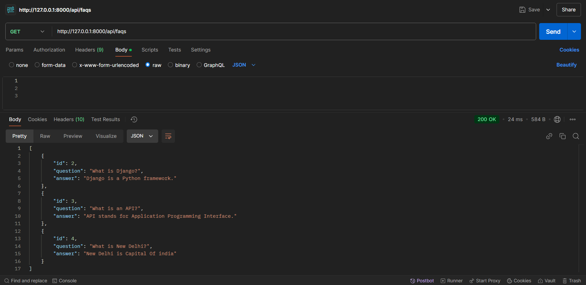
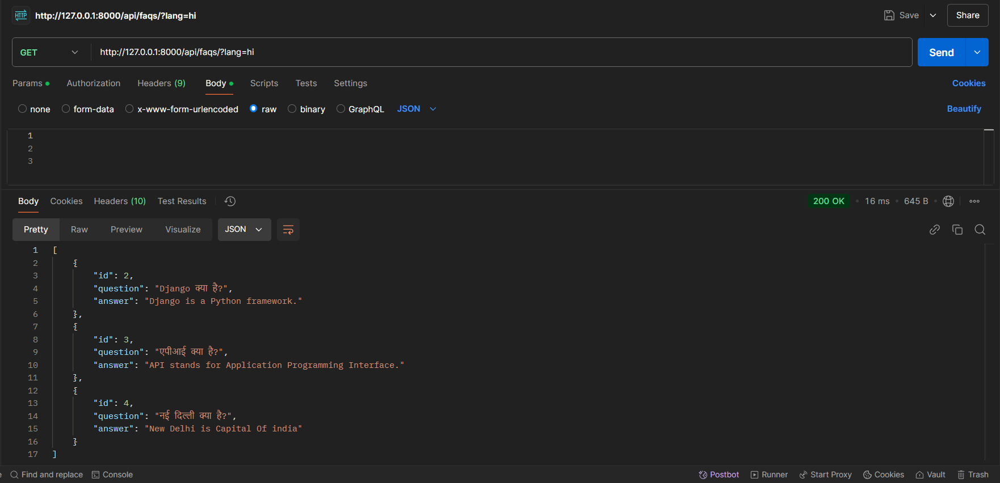
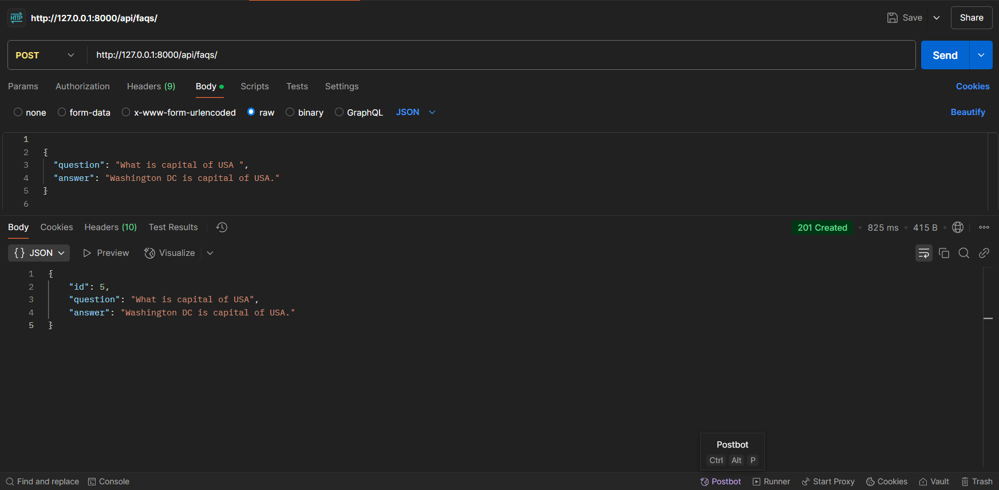
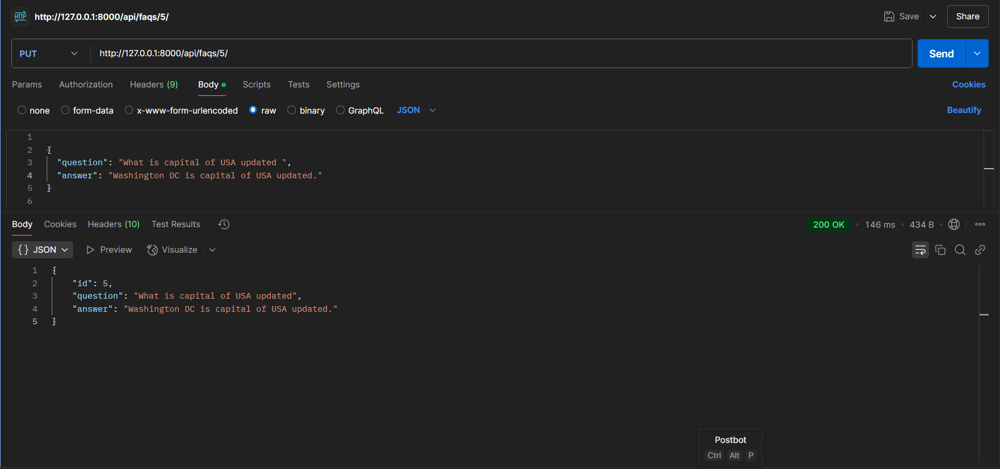
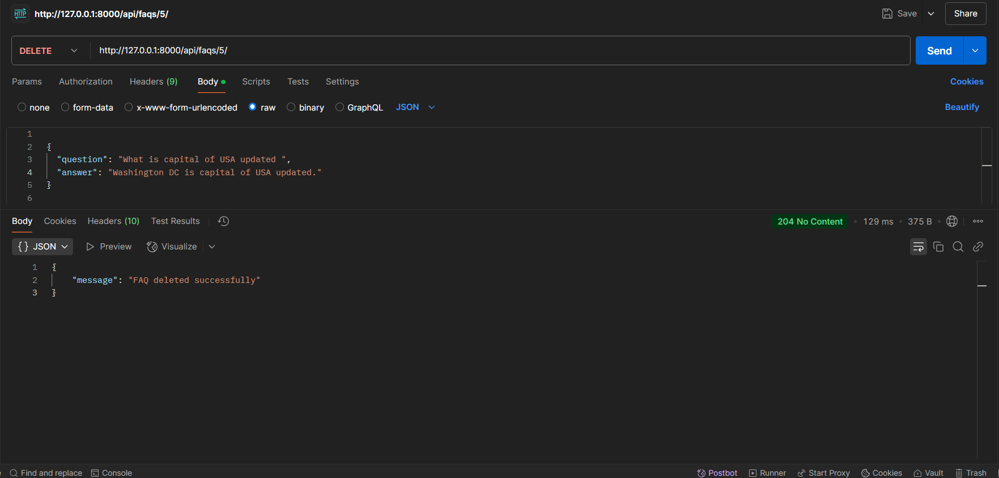

📝 FAQ API - Built with Django & DRF
This project is a Django-powered FAQ API, featuring multilingual translations, a rich-text editor, Redis-based caching, and a fully functional REST API.

🚀 Key Highlights
✅ REST API for seamless FAQ management
🌍 Supports multiple languages via Google Translate
✍ Rich-text editing with CKEditor 5
⚡ Redis caching for optimized speed
📝 Comprehensive unit testing for models & APIs

## 🔗 API Endpoints

| Method | Endpoint             | Description       |
| ------ | -------------------- | ----------------- |
| GET    | `/api/faqs/`         | Get all FAQs      |
| GET    | `/api/faqs/?lang=hi` | Get FAQs in Hindi |
| POST   | `/api/faqs/`         | Create a new FAQ  |
| PUT    | `/api/faqs/{id}/`    | Update an FAQ     |
| DELETE | `/api/faqs/{id}/`    | Delete an FAQ     |

## 📌 API Endpoints and Screenshots

**Request in Postman:**


---

**Request in Postman:**


---

**Request in Postman:**


---

**Request in Postman:**


---

**Request in Postman:**


---

📌 **Example API Call Using Curl:**

```sh
curl http://127.0.0.1:8000/api/faqs/?lang=hi
```

## ✅ Running Unit Tests

Run the following command to execute **all unit tests**:

```sh
python manage.py test
```

---

## 🔧 Technologies Used

- **Backend:** Django, Django REST Framework
- **Database:** SQLite (Default), PostgreSQL (Optional)
- **Caching:** Redis
- **Editor:** CKEditor 5
- **Translation API:** Google Translate

---

---

---

## 📜 License

This project is licensed under the **MIT License**. See the [LICENSE](LICENSE) file for details.

---
